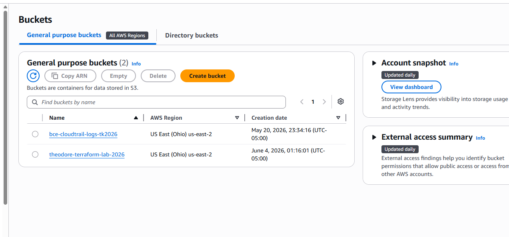
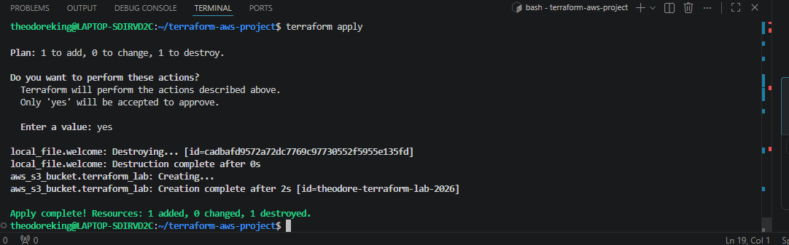
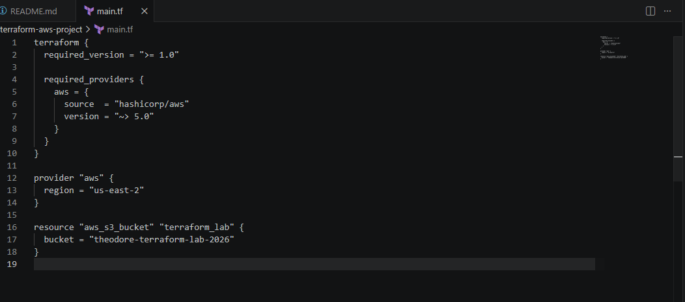
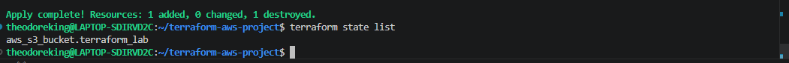
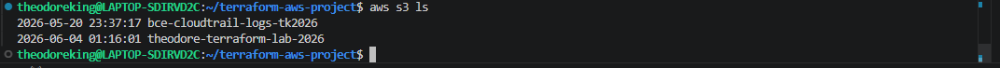

# BCE Week 5 – Terraform Infrastructure as Code (IaC) Project

Production-style Infrastructure as Code (IaC) project built using Terraform, AWS CLI, Amazon S3, GitHub, Linux (WSL), and Visual Studio Code.

This project demonstrates how cloud engineers automate AWS infrastructure provisioning using Terraform rather than manually creating resources through the AWS Console.

---

# Project Overview

The purpose of this project was to learn Infrastructure as Code (IaC) principles by deploying AWS resources through Terraform configuration files.

Instead of manually clicking through the AWS Console, infrastructure was defined in code and deployed using Terraform commands.

This project demonstrates:

- Infrastructure as Code (IaC)
- Terraform configuration management
- AWS provider integration
- AWS CLI authentication
- Terraform state management
- Automated AWS resource deployment
- Version-controlled infrastructure
- Cloud engineering deployment workflows

The project successfully deployed an Amazon S3 bucket using Terraform and validated the deployment through AWS CLI and Terraform state tracking.

---

# What is Infrastructure as Code (IaC)?

Infrastructure as Code (IaC) is the practice of managing and provisioning infrastructure through code instead of manual configuration.

Traditionally, cloud resources are created manually through the AWS Console.

With Terraform, cloud engineers can:

- Define infrastructure in code
- Reuse deployments
- Version control infrastructure
- Reduce configuration errors
- Automate cloud deployments
- Standardize environments

This approach is widely used across cloud engineering, DevOps, platform engineering, and site reliability engineering (SRE) teams.

---

# Technologies Used

## Cloud Platform

- Amazon Web Services (AWS)

## Infrastructure as Code

- Terraform v1.15.5

## AWS Services

- Amazon S3
- AWS IAM
- AWS CLI

## Development Tools

- Visual Studio Code
- Windows Subsystem for Linux (WSL)
- Git
- GitHub

---

# Project Architecture

```text
Developer
    │
    ▼
Terraform Configuration Files
    │
    ▼
Terraform Provider (AWS)
    │
    ▼
AWS API
    │
    ▼
Amazon S3 Bucket
```

Terraform communicates directly with AWS APIs to create and manage infrastructure resources.

---

# Terraform Configuration

The Terraform configuration included:

### Provider Configuration

```hcl
provider "aws" {
  region = "us-east-2"
}
```

### S3 Bucket Resource

```hcl
resource "aws_s3_bucket" "terraform_lab" {
  bucket = "theodore-terraform-lab-2026"
}
```

### Output Values

```hcl
output "bucket_name" {
  value = aws_s3_bucket.terraform_lab.bucket
}
```

---

# Deployment Process

The deployment followed the standard Terraform workflow:

### Initialize Terraform

```bash
terraform init
```

### Review Infrastructure Changes

```bash
terraform plan
```

### Deploy Infrastructure

```bash
terraform apply
```

### Verify Infrastructure

```bash
terraform state list
```

### Validate with AWS CLI

```bash
aws s3 ls
```

---

# Project Validation Screenshots

## Amazon S3 Bucket Successfully Created



---

## Terraform Apply Successful



---

## Terraform Infrastructure Code



---

## Terraform State Management



---

## AWS CLI Validation



---

# Skills Demonstrated

## Cloud Engineering

- AWS Infrastructure Deployment
- AWS IAM Authentication
- AWS CLI Usage
- Amazon S3 Administration

## Infrastructure as Code

- Terraform Configuration
- Provider Management
- Resource Provisioning
- State Management
- Infrastructure Automation

## Linux Administration

- WSL Usage
- Command Line Operations
- File Management
- Package Installation

## DevOps Practices

- Version Control
- Infrastructure Documentation
- Deployment Validation
- Change Management

---

# Resources Created

| Resource | Purpose |
|-----------|----------|
| Amazon S3 Bucket | Object storage resource deployed through Terraform |
| Terraform State File | Tracks deployed infrastructure |
| AWS CLI Configuration | Authenticates Terraform to AWS |
| GitHub Repository | Version control and project documentation |

---

# Cost Analysis

## AWS Resources Used

### Amazon S3

The project deployed a single Amazon S3 bucket.

Expected cost:

- Free Tier Eligible
- Approximately $0.00 while empty
- Storage costs only apply when data is stored

### AWS IAM

No cost.

### Terraform

Open-source software.

No cost.

### AWS CLI

Free.

### GitHub

Free public repository.

---

# Key Learning Outcomes

Through this project I learned how to:

- Authenticate Terraform to AWS
- Configure Terraform providers
- Deploy AWS infrastructure using code
- Manage Terraform state
- Validate infrastructure deployments
- Use AWS CLI for verification
- Document cloud projects professionally
- Build Infrastructure as Code workflows used by cloud engineers

---

# Future Enhancements

Future versions of this project will expand beyond Amazon S3 and include:

- VPC Creation
- Public and Private Subnets
- Security Groups
- EC2 Instances
- RDS Databases
- Load Balancers
- IAM Roles
- Multi-tier Architectures

---

# Author

**Theodore King**

Cloud Engineering Portfolio Project

BCE Cloud Engineers Bootcamp – Week 5 Terraform Infrastructure as Code Lab
